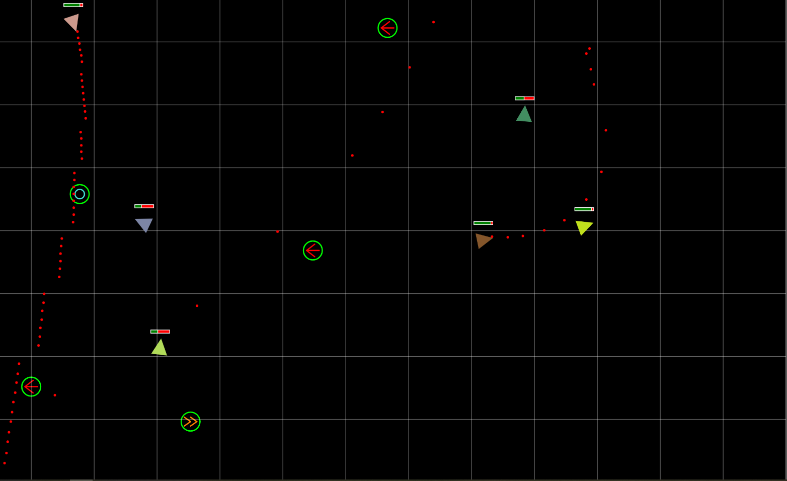

# Space Battle

*Created in 2018* 
A top down shooting game, last man standing. 
Written in `javascript` and `html`. 
Using the [p5.js](https://p5js.org/) library for the game objects and the game rendering.  

# How to run
You can run this game by opening the [index.html](./index.html) in your browser or you can run a simple http server in the root folder of this repo e.g. (in python) `python -m http.server`

# Controls
`space bar` hold it to shoot the laser beam. 
`arrow up` hold to thrust forward. 
`arrow left/right` turn the ship left or right. 
`a` toggle AI, let the computer play for you. 
`r` when it is game over press this key to restart the game.

# Power Ups
 puts a shield around your ship that gives you some extra health. 
 completely heals the damage taken. 
 gives you a temporary speed buff. 
 temporary shoot 3 laser beams.

